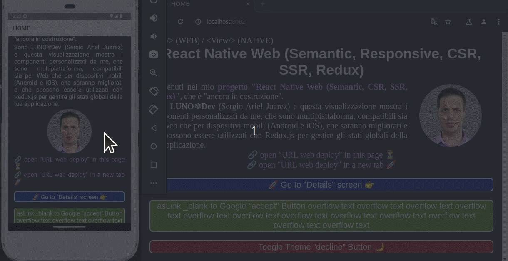

<h1 style="color: red; align: center; text-align: center;">
    REACT NATIVE WEB SEMANTICO
</h1>

## Multi lingua README

[](https://github.com/sergiodevelops/ReactNativeMinimal_LunoDev/blob/master/README.md)

[](https://github.com/sergiodevelops/ReactNativeMinimal_LunoDev/blob/master/README.es.md)

[//]: # ([![React Native and Web Semantic with CSR & SSR tecniches]&#40;documentation/react-navigation-native-web_v1.0.6_2024-07-14.gif "React Native & Web Semantic &#40;CSR & SSR&#41;"&#41;]&#40;https://sergiodevelops.github.io/ReactNativeMinimal_LunoDev/&#41;)

<div style="align: center; text-align: center;" >
    <code>ReactNativeMinimal_LunoDev</code>
    
</div>

<div style="align: center; text-align: center;" >
    <p style="align: justify; text-align: justify;">
        Benvenuti nel mio <strong>progetto "React Native Web (Semantic, CSR, SSR, Redux)"</strong>, che è "ancora in costruzione":
    </p>
    <a target="_blank" href="https://sergiodevelops.github.io/ReactNativeMinimal_LunoDev/">
        🔗 Clicca qui per vedere questo progetto distribuito sulla piattaforma web 🔗️
    </a>
    <p style="align: justify; text-align: justify;">
        Sono <strong>LUNO⚛Dev</strong> (<a target={"_blank"} href={"https://github.com/sergiodevelops"}>sergiodevelops</a>) e questa visualizzazione mostra componenti da me, che sono multipiattaforma, compatibili sia per dispositivi web che mobili (Android e iOS), che verranno migliorati e che possono essere utilizzati con Redux.js per gestire gli stati globali della tua applicazione.
    </p>
</div>

Utilizzato in questo progetto:
<ul>
    <li><strong>Node.js</strong> (cross-platform JavaScript runtime environment)</li>
    <li><strong>React & Native & Web & Navigation</strong></li>
    <li><strong>SSR & CSR</strong> (web techniques)</li>
    <li><strong>Redux.js</strong> (web store)</li>
    <li><strong>Java(TM) SE Runtime Environment & Android SDK</strong> (web store)</li>
</ul>

<h3 style="align: center; text-align: center; margin: 0; padding: 0;">
    by <strong style="color: blue">LUNO⚛Dev</strong>
</h3>

## Scarica ed esegui questo progetto Web React Native
### Scarica questo progetto
```bash
# Download by HTTPS
git clone https://github.com/sergiodevelops/ReactNativeMinimal_LunoDev.git
```
```bash
# Download by SSH
git clone git@github.com:sergiodevelops/ReactNativeMinimal_LunoDev.git
```

### Installa le dipendenze
```bash
# with YARN
yarn
```
```bash
# or with NPM
npm install
```

### Corri per piattaforme NATIVE (Android / iOS).

Può essere un dispositivo Android fisico o, più comunemente, puoi utilizzare un dispositivo virtuale Android che ti consente di emulare un dispositivo Android sul tuo computer.

<a target="_blank" href="https://reactnative.dev/docs/running-on-device">
    🔗 In esecuzione su dispositivo Android fisico 🔗
</a>
<br/>
<a target="_blank" href="https://groovetechnology.com/blog/running-a-react-native-app-on-android-studio-a-step-by-step-guide/">
    🔗 In esecuzione su dispositivo Android virtuale (emulatore) 🔗
</a>

```bash
# with YARN
yarn native:start
```
```bash
# or with NPM
npm run native:start
```

### Corri per piattaforme WEB
#### by server-side rendering (SSR)
```bash
# with YARN
yarn web:ssr:start
```
```bash
# or with NPM
npm run web:ssr:start
```

#### by client-side rendering (CSR)
```bash
# with YARN
yarn web:csr:start # web server CSR (Client Side Rendering)
```
```bash
# or with NPM
npm run web:csr:start
```

## Le mie informazioni di sistema Linux Ubuntu aggiuntive (ambiente di sviluppo)

```bash
node -v
# my "node.js" version 
# $ v20.11.0
```

```bash
npm -v
# "npm" version 
# $ 10.8.1
```

```bash
yarn -v
# "yarn" version 
# $ 3.6.4
```

```bash
# Example: "node" path
which node
# $ $HOME/.nvm/versions/node/v20.11.0/bin/node
```

```bash
# Example: "java" path
which java
# $ /usr/bin/java
```

```bash
# Example: "yarn" path
which yarn
# $ $HOME/.nvm/versions/node/v20.11.0/bin/yarn
```

```bash
# Example: "npm" path
which npm
# $ $HOME/.nvm/versions/node/v20.11.0/bin/npm
```

```bash
java --version
# $ java 17.0.11 2024-04-16 LTS
# $ Java(TM) SE Runtime Environment (build 17.0.11+7-LTS-207)
# $ Java HotSpot(TM) 64-Bit Server VM (build 17.0.11+7-LTS-207, mixed mode, sharing)
```

```bash
# if $ANDROID_HOME is set correctly execute:
emulator -v
# $ INFO  | Storing crashdata in: /tmp/android-sjuarez/emu-crash-34.2.15.db, detection is enabled for process: 120127
# $ INFO  | Android emulator version 34.2.15.0 (build_id 11906825) (CL:N/A)
# $ ERROR | No AVD specified. Use '@foo' or '-avd foo' to launch a virtual device named 'foo'
```

```bash
# with YARN
yarn react-native info
```

```bash
# or with NPM
npm run react-native info
```

```
$ info Fetching system and libraries information...
System:
  OS: Linux 5.15 Ubuntu 20.04.6 LTS (Focal Fossa)
  CPU: (8) x64 Intel(R) Core(TM) i7-8550U CPU @ 1.80GHz
  Memory: 4.39 GB / 15.51 GB
  Shell:
    version: 5.0.17
    path: /bin/bash
Binaries:
  Node:
    version: 20.11.0
    path: /tmp/xfs-bc5ab604/node
  Yarn:
    version: 3.6.4
    path: /tmp/xfs-bc5ab604/yarn
  npm:
    version: 10.8.1
    path: ~/.nvm/versions/node/v20.11.0/bin/npm
  Watchman:
    version: 4.9.0
    path: /usr/bin/watchman
SDKs:
  Android SDK:
    API Levels:
      - "31"
      - "33"
      - "34"
      - "35"
    Build Tools:
      - 30.0.3
      - 34.0.0
      - 35.0.0
    System Images:
      - android-33 | Google APIs Intel x86_64 Atom
      - android-35 | Google APIs Intel x86_64 Atom
    Android NDK: Not Found
IDEs:
  Android Studio: AI-241.15989.150.2411.11948838
Languages:
  Java:
    version: 17.0.11
    path: /usr/bin/javac
  Ruby: Not Found
npmPackages:
  "@react-native-community/cli": Not Found
  react:
    installed: 18.2.0
    wanted: 18.2.0
  react-native:
    installed: 0.74.3
    wanted: ^0.74.2
npmGlobalPackages:
  "*react-native*": Not Found
Android:
  hermesEnabled: true
  newArchEnabled: false
iOS:
  hermesEnabled: Not found
  newArchEnabled: false
```
