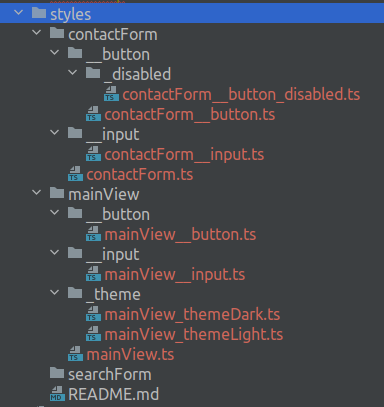

# BEM (CSS naming convention) metodology

- [BEM website 1](https://sourcedcode.com/blog/css/what-is-bem-with-examples#valid-bem-naming/)
- [BEM website 2](https://en.bem.info/methodology/quick-start/)
- [BEM website 3](https://www.geeksforgeeks.org/understanding-the-css-bem-convention/)

## CSS (BEM notation) --> "kebab-case"
```
* variant 1
block1__element1_modifier-value 
block1__element2_modifier-value 
or
* variant 2
block1__element1--modifier-value 
block1__element2--modifier-value
```
### BLOCK - Component of code functionally independent component of the page
```
* block-name <-- block name
.post-card {}
```
### ELEMENT - Component of code functionally dependent on its parent block
```
* __elem-name <-- element name "__"
.post-card__button {}
```
### MODIFIER - Describe a state, action (or behavior) or appearance  
```
* --mod-name <-- modifier
.post-card__button_download {}
.post-card__button--download {}
.contact-form__button_enabled {}
.contact-form__button--enabled {}
* --mod-name_value-name <-- modifierValue (type key-value)
* --mod-name_value-name <-- modifierValue (type key-value)
.post-card__button_size-sm {} "_"
.post-card__button--size-sm {} "--"
```

## TS/JS (BEM notation)--> "camelCase"
```
blockName1__elementName1_modifierNameValueName
blockName1__elementName2_modifierNameValueName
```
### BLOCK - Component of code functionally independent component of the page
```
* block-name <-- block (name space)
.postCard {}
```
### ELEMENT - Component of code functionally dependent on its parent block
```
* __elem-name <-- element (role into the block) "__"
.postCard__button {}
```
### MODIFIER - Describe a state, action (or behavior) or appearance  
```
* _modName <-- modifier "_modKey"
.postCard__button_download {}
.contactForm__button_disabled {}
* _modNameValueName <-- modifierValue (type keyValue) "_modKeyValue"
.postCard__button_sizeSm {} <-- size (key) = "medium" (value)
```

## Structure directories example
```
src/styles/ 
│
├── contactForm/
│         ├── contactForm.ts
│         │
│         ├── __button/
│         │         ├── contactForm__button.ts
│         │         │
│         │         ├── _disabled/
│         │         │   └── contactForm__button_disabled.ts
│         │         └── _size$md/
│         │             └── contactForm__button_size$md.ts
│         └── __input/
│             │
│             └── contactForm__input.ts
├── mainView/
          ├── mainView.ts
          │
          ├── __button/
          │         └── mainView__button.ts
          ├── __input/
          │         └── mainView__input.ts
          └── _theme/
              ├── mainView_themeDark.ts
              └── mainView_themeLight.ts
```


